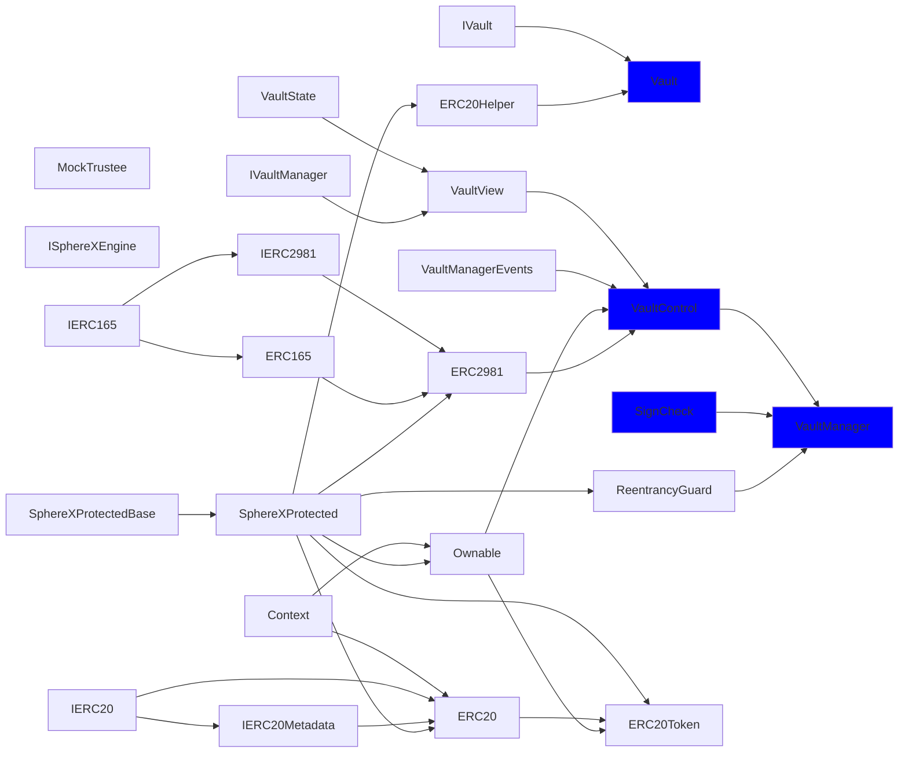

```mermaid
flowchart LR
IVault_ff6a68e2512f4f487743db8efae0090e[IVault]

Vault_05c0089cf0aeec316b54bd7237acb64c[Vault]:::changed
IVault_ff6a68e2512f4f487743db8efae0090e --> Vault_05c0089cf0aeec316b54bd7237acb64c
ERC20Helper_b5809bea5617a4443cd27d635a7e7d3c --> Vault_05c0089cf0aeec316b54bd7237acb64c

IVaultManager_42b36ec0827b2c3b3b2bd6bb984ab9c6[IVaultManager]

SignCheck_fbd6d8930b5db0462f5c61acc574adf4[SignCheck]:::changed

VaultControl_17727bb6a4f1ce98a0f6d1ae4a05e8f0[VaultControl]:::changed
VaultView_762996f416c96f8a633ebb4990f5c109 --> VaultControl_17727bb6a4f1ce98a0f6d1ae4a05e8f0
VaultManagerEvents_33860bd4689435e0310b4c50fea36db0 --> VaultControl_17727bb6a4f1ce98a0f6d1ae4a05e8f0
Ownable_abe17e578caf7131449c43d44591c630 --> VaultControl_17727bb6a4f1ce98a0f6d1ae4a05e8f0
ERC2981_e8ce0245043f0a7ed1ade7a942ca1e13 --> VaultControl_17727bb6a4f1ce98a0f6d1ae4a05e8f0

VaultManager_18050cbf4389678bb50f944a6a6780c1[VaultManager]:::changed
VaultControl_17727bb6a4f1ce98a0f6d1ae4a05e8f0 --> VaultManager_18050cbf4389678bb50f944a6a6780c1
SignCheck_fbd6d8930b5db0462f5c61acc574adf4 --> VaultManager_18050cbf4389678bb50f944a6a6780c1
ReentrancyGuard_342d7dc7d48325b21e3c6e9f605b36bb --> VaultManager_18050cbf4389678bb50f944a6a6780c1

VaultManagerEvents_33860bd4689435e0310b4c50fea36db0[VaultManagerEvents]

VaultState_e18bb107641c33a864c3db1cb54e6cba[VaultState]

VaultView_762996f416c96f8a633ebb4990f5c109[VaultView]
VaultState_e18bb107641c33a864c3db1cb54e6cba --> VaultView_762996f416c96f8a633ebb4990f5c109
IVaultManager_42b36ec0827b2c3b3b2bd6bb984ab9c6 --> VaultView_762996f416c96f8a633ebb4990f5c109

MockTrustee_8dfb680afd9570a055b4ea2f522c4aea[MockTrustee]

ISphereXEngine_eb9c37cb854d45c82ea18a765d2412f6[ISphereXEngine]

SphereXProtected_fb8a65f5c20a9237bed7d613d3d4d6db[SphereXProtected]
SphereXProtectedBase_a253e9ec6d3977f0d98637aaff485743 --> SphereXProtected_fb8a65f5c20a9237bed7d613d3d4d6db

SphereXProtectedBase_a253e9ec6d3977f0d98637aaff485743[SphereXProtectedBase]

Ownable_abe17e578caf7131449c43d44591c630[Ownable]
Context_1b832f93a04c8d37a4b472e049129468 --> Ownable_abe17e578caf7131449c43d44591c630
SphereXProtected_fb8a65f5c20a9237bed7d613d3d4d6db --> Ownable_abe17e578caf7131449c43d44591c630

IERC2981_4451bed966921044bd347683aa9af223[IERC2981]
IERC165_d111e320ae5eb8e9b7698ed7c3a4269c --> IERC2981_4451bed966921044bd347683aa9af223

ReentrancyGuard_342d7dc7d48325b21e3c6e9f605b36bb[ReentrancyGuard]
SphereXProtected_fb8a65f5c20a9237bed7d613d3d4d6db --> ReentrancyGuard_342d7dc7d48325b21e3c6e9f605b36bb

ERC20_21a31a89cd0e487f21bb42379af29f9c[ERC20]
Context_1b832f93a04c8d37a4b472e049129468 --> ERC20_21a31a89cd0e487f21bb42379af29f9c
IERC20_519b92537fbcec738ac431937c69e24b --> ERC20_21a31a89cd0e487f21bb42379af29f9c
IERC20Metadata_da08a759551118fe08d919d051c611ad --> ERC20_21a31a89cd0e487f21bb42379af29f9c
SphereXProtected_fb8a65f5c20a9237bed7d613d3d4d6db --> ERC20_21a31a89cd0e487f21bb42379af29f9c

IERC20_519b92537fbcec738ac431937c69e24b[IERC20]

IERC20Metadata_da08a759551118fe08d919d051c611ad[IERC20Metadata]
IERC20_519b92537fbcec738ac431937c69e24b --> IERC20Metadata_da08a759551118fe08d919d051c611ad

ERC2981_e8ce0245043f0a7ed1ade7a942ca1e13[ERC2981]
IERC2981_4451bed966921044bd347683aa9af223 --> ERC2981_e8ce0245043f0a7ed1ade7a942ca1e13
ERC165_1a60d2a0ea16254313a74a2155a2f207 --> ERC2981_e8ce0245043f0a7ed1ade7a942ca1e13
SphereXProtected_fb8a65f5c20a9237bed7d613d3d4d6db --> ERC2981_e8ce0245043f0a7ed1ade7a942ca1e13

Context_1b832f93a04c8d37a4b472e049129468[Context]

ERC165_1a60d2a0ea16254313a74a2155a2f207[ERC165]
IERC165_d111e320ae5eb8e9b7698ed7c3a4269c --> ERC165_1a60d2a0ea16254313a74a2155a2f207

IERC165_d111e320ae5eb8e9b7698ed7c3a4269c[IERC165]

ERC20Helper_b5809bea5617a4443cd27d635a7e7d3c[ERC20Helper]
SphereXProtected_fb8a65f5c20a9237bed7d613d3d4d6db --> ERC20Helper_b5809bea5617a4443cd27d635a7e7d3c

ERC20Token_93b18f8377fb0174b7c4e29a9965f13a[ERC20Token]
SphereXProtected_fb8a65f5c20a9237bed7d613d3d4d6db --> ERC20Token_93b18f8377fb0174b7c4e29a9965f13a
ERC20_21a31a89cd0e487f21bb42379af29f9c --> ERC20Token_93b18f8377fb0174b7c4e29a9965f13a
Ownable_abe17e578caf7131449c43d44591c630 --> ERC20Token_93b18f8377fb0174b7c4e29a9965f13a

classDef changed fill:blue
```
